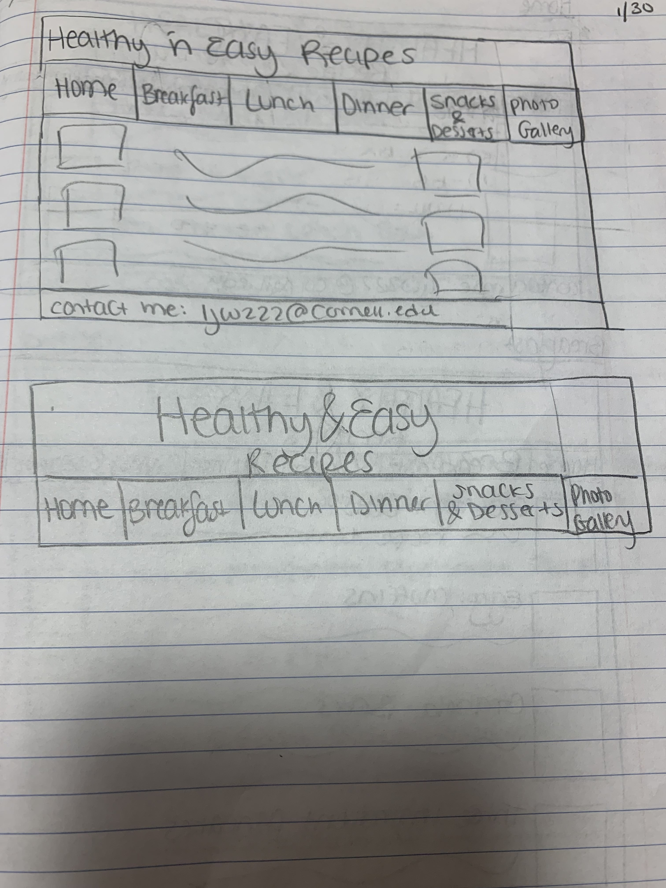
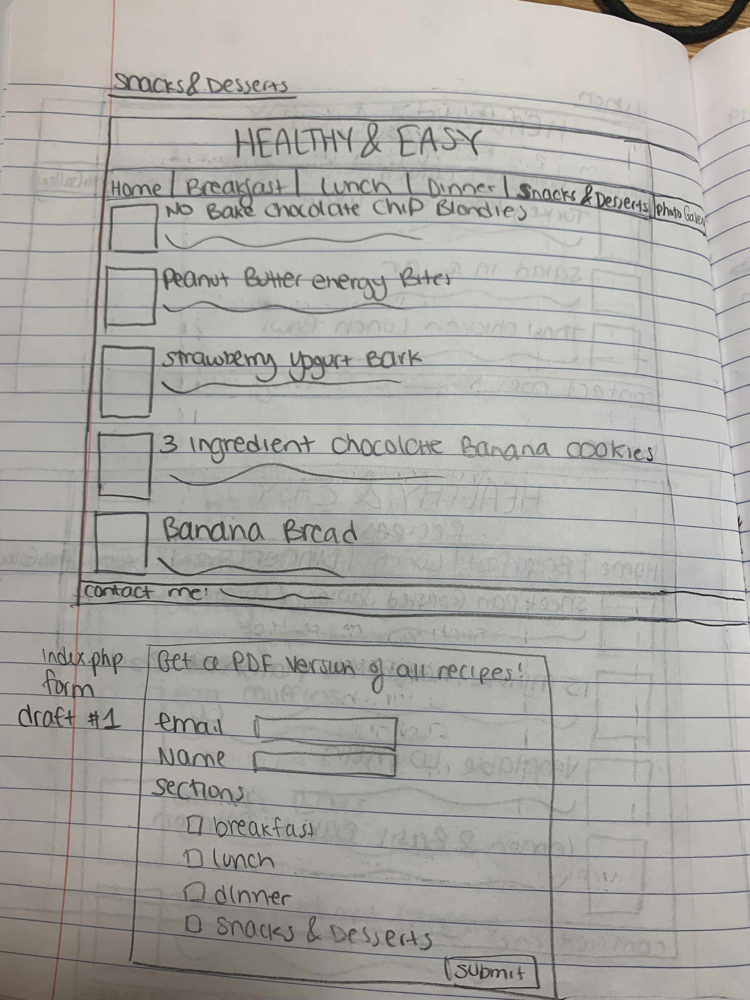
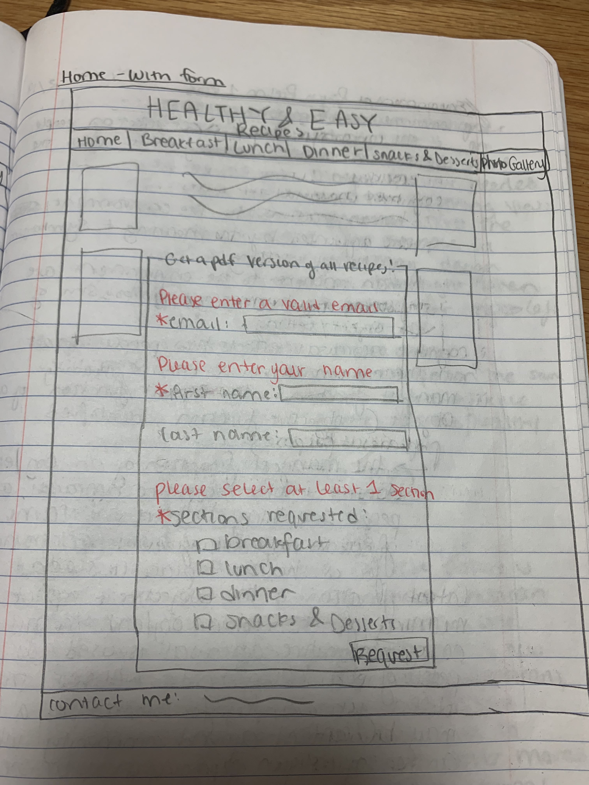
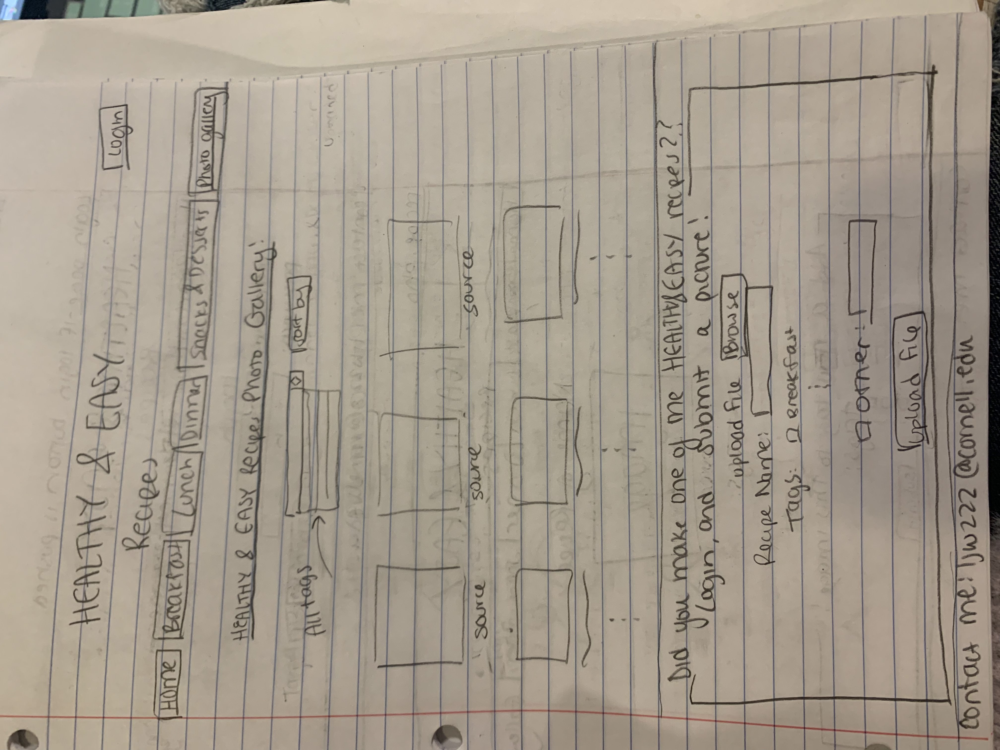

# Project 3: Design Journey

Your Name: [Lucy Wang]

**All images must be visible in Markdown Preview. No credit will be provided for images in your repository that are not properly linked in Markdown. Assume all file paths are case sensitive!**


# Project 3, Milestone 1 - Design, Plan, & Draft Website

## Describe your Gallery

[What will your gallery be about? 1 sentence.]

  An image gallery of all of the images to the recipes included on the site, as well as user submitted images of the food that they made from recipes on this site.


## Target Audiences

[Tell us about your target two audiences. ~1-3 sentences per audience]

  My first target audience are college students who are busy and do not have much time or money to spend on their meals, but still want to live a healthy lifestyle. Due to their time constraint, they need easy access to recipes that they know are simple and nutritious, which this website provides.

  My second target audience are working parents who must nourish their families, but like college students do not have large amounts of time to dedicate to each meal. Because they are working for many hours of the day, they need breakfast, lunch, and snack recipes that can be prepared ahead of time, as well as dinner options that are both healthy and quick to make.

  The photo gallery will make it even simpler for both audiences to browse recipes, as they will be able to skim all recipe images on one page.


## Design Process

[Document your design process. Show us the evolution of your design from your first idea (sketch) to design you wish to implement (sketch). Show us the process you used to organize content and plan the navigation (e.g. card sorting).]

[Label all images. All labels must be visible in Markdown Preview.]
From Project 1:







## Final Design Plan

[Include sketches of your final design here.]
From Project 1:




## Templates

[Identify the templates you will use on your site.]

I will have a template for the header as well as the footer.

## Database Schema Design

[Describe the structure of your database. You may use words or a picture. A bulleted list is probably the simplest way to do this. Make sure you include constraints for each field.]

[Hint: You probably need `users`, `images`, `tags`, and `image_tags` tables.]

[Hint: For foreign keys, use the singular name of the table + _id. For example: 1) `user_id` in the `images` table or 2) `image_id` and `tag_id` for the `image_tags` table.]

```
users (
id : INTEGER {PK, U, Not, AI} -- surrogate primary key
username: TEXT {U, Not}
password: TEXT {U, Not}
)
```

```
images (
id : INTEGER {PK, U, Not, AI} -- surrogate primary key
file_name: TEXT {U, Not}
recipe_name: TEXT {U, Not}
source: TEXT {U, Not}
)
```

```
tags (
id : INTEGER {PK, U, Not, AI} -- surrogate primary key
tag: TEXT {U, Not}
)
```

```
image_tags (
id : INTEGER {PK, U, Not, AI} -- surrogate primary key
image_id: TEXT {U, Not}
tag_id: TEXT {U, Not}
)
```


## Code Planning

[Plan what top level PHP pages you'll need.]

From Project 1:
  index.php
  breakfast.php
  lunch.php
  dinner.php
  snacks.php
New:
  photo.php
  login.php

[Plan what templates you'll need.]

header.php, footer.php

[Plan any PHP code you'll need.]

Example:
```
function is_user_logged_in() {
  if user is logged in, return true
  otherwise, return false
}

// Show logout, only if user is logged in.
if user is logged in (is_user_logged_in()) then
  show logout link
else
  show login link
end
```

//only allow an image to be submitted if the user is logged in
when the submit button is pressed for the submit image form
  if the user is logged in
    submit image. Display text saying "Thanks for submitting an image!"
  else
    dont submit the image. Display text saying "You must login inorder to submit an image".

//login
if the login button is pressed
  bring the user to the login page

//sort gallery by image tags
if no tags are selected
  display all images
if the breakfast tag is selected
  display images with the breakfast tag
if the lunch tag is selected
  display images with the lunch tag
if the dinner tag is selected
  display images with the dinner tag
if the snacks and desserts tag is selcted
  display images with the snacks and desserts tag
if the user uploaded tag is selected
  display images with the user uploaded tag

## Database Query Plan

[Plan your database queries. You may use natural language, pseudocode, or SQL.]
-no tags:
  ```sql
  SELECT images.file_name, images.recipe_name FROM image_tags
    INNER JOIN images
        ON image_tags.image_id = images.id
    INNER JOIN tags
        ON image_tags.tag_id = tag.id
  ```
-breakfast:
  ```sql
  SELECT images.file_name, images.recipe_name FROM image_tags
    INNER JOIN images
        ON image_tags.image_id = images.id
    INNER JOIN tags
        ON image_tags.tag_id = tag.id
    WHERE tags.tag = "breakfast";
  ```
-lunch:
  ```sql
  SELECT images.file_name, images.recipe_name FROM image_tags
    INNER JOIN images
        ON image_tags.image_id = images.id
    INNER JOIN tags
        ON image_tags.tag_id = tag.id
    WHERE tags.tag = "lunch";
  ```
-dinner:
  ```sql
  SELECT images.file_name, images.recipe_name FROM image_tags
    INNER JOIN images
        ON image_tags.image_id = images.id
    INNER JOIN tags
        ON image_tags.tag_id = tag.id
    WHERE tags.tag = "dinner";
  ```
-snacks and desserts:
  ```sql
  SELECT images.file_name, images.recipe_name FROM image_tags
    INNER JOIN images
        ON image_tags.image_id = images.id
    INNER JOIN tags
        ON image_tags.tag_id = tag.id
    WHERE tags.tag = "snacks";
  ```
-user uploaded:
  ```sql
  SELECT images.file_name, images.recipe_name FROM image_tags
    INNER JOIN images
        ON image_tags.image_id = images.id
    INNER JOIN tags
        ON image_tags.tag_id = tag.id
    WHERE tags.tag = "user_uploaded";
  ```


# Project 3, Milestone 2 - Gallery and User Access Controls

## Issues & Challenges

[Tell us about any issues or challenges you faced while trying to complete milestone 2. 2-4 sentences/bullet points]


# Final Submission: Complete & Polished Website

## Reflection

[Take this time to reflect on what you learned during this assignment. How have you improved since starting this class? 2-4 sentences]
